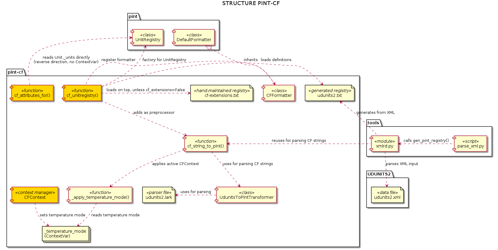
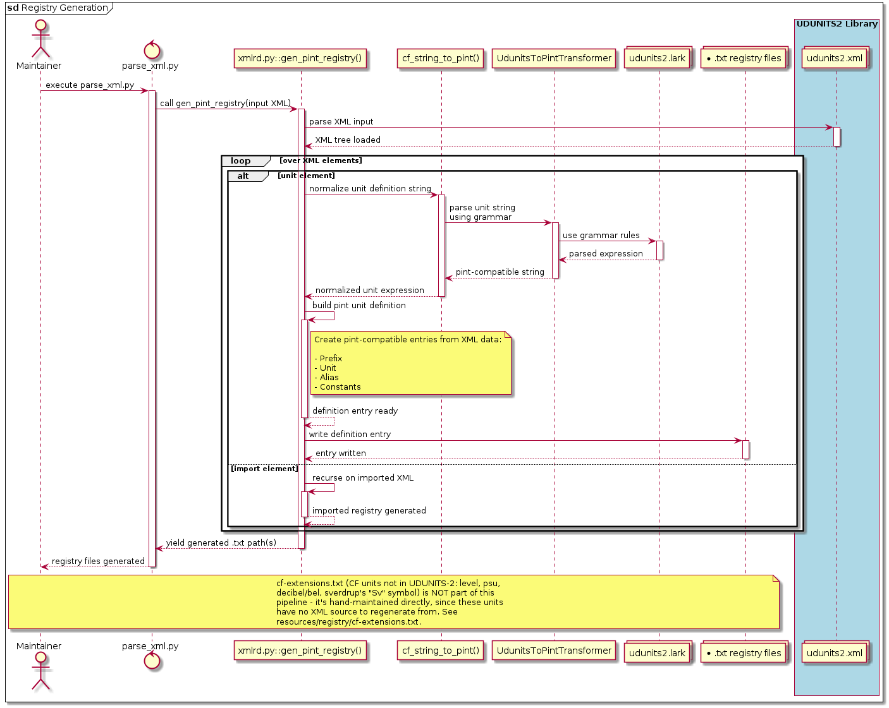
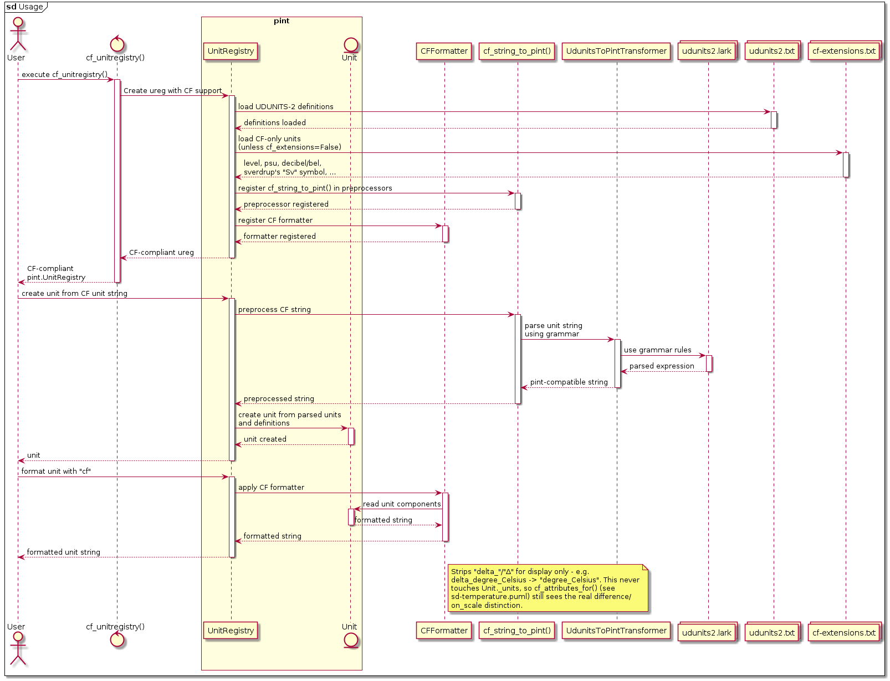
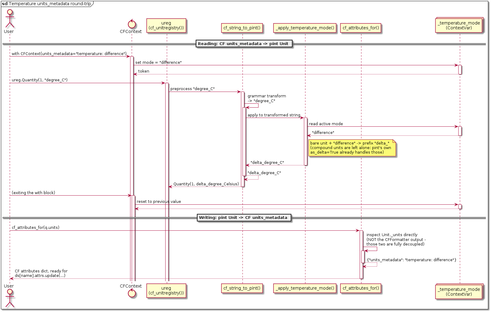

# Package overview

## Structure

`pint-cf` provides three public symbols:

- `cf_unitregistry(*, cf_extensions=True)` - the main entry point, returns a
  `pint.UnitRegistry` with CF/UDUNITS-2 support.
- `CFContext` - a context manager that makes a CF `units_metadata` attribute
  (temperature `on_scale`/`difference`) visible to the preprocessor while a
  unit/quantity is being constructed.
- `cf_attributes_for(unit_or_quantity)` - the reverse direction: derives CF
  variable attributes back from an already-computed Unit/Quantity.

`cf_unitregistry()` builds the registry with these features:

- Loads definitions from the generated UDUNITS-2 registry files, plus (by
  default) `cf-extensions.txt` - CF units that UDUNITS-2 itself doesn't
  define (`level`, `sigma_level`, `layer`, `practical_salinity_unit`/`psu`,
  `decibel`/`bel`, and reassigning `sverdrup`'s `Sv` symbol - see
  [issue #10](https://github.com/pgamez/pint-cf/issues/10)). Pass
  `cf_extensions=False` to skip this and get a registry that matches plain
  UDUNITS-2 instead.
- Adds a preprocessor `cf_string_to_pint()` that transforms CF/UDUNITS-2
  strings into pint strings at `pint.Unit`/`pint.Quantity` creation time,
  using a Lark grammar internally for parsing. It also applies the active
  `CFContext`'s temperature mode at the end (via `_apply_temperature_mode()`,
  reading a `ContextVar`).
- Adds a second preprocessor, `_warn_if_deprecated_cf_unit()` (unless
  `cf_extensions=False`), that warns (`DeprecationWarning`) on the
  COARDS-only `level`/`sigma_level`/`layer` placeholders - a no-op
  transform, run purely for that side effect.
- Registers a custom formatter `CFFormatter` that transforms pint unit
  syntax back into CF strings for display - it strips `delta_`/`Δ`, which
  is purely cosmetic: `cf_attributes_for()` reads `Unit._units` directly and
  is unaffected by it.
- Disables pint's own `parse_unit` cache (`_NoCache`), so a `CFContext`
  entered/exited around repeated calls with the same raw unit string is
  never served a stale result from an earlier, differently-contexted call.

## Registry files generation

The registry file(s) mirroring UDUNITS-2 are generated using a script
excluded from the package. The code is located in the directory `tools`.
There are:

- The CLI script `parse_xml.py` that launches the process.
- The `.xml` files containing units definitions, obtained from the UDUNITS2
  library repository.
- A module `xmlrd.py` that transforms the XML elements into Pint Unit
  definitions:
  - Uses `cf_string_to_pint()` to generate the unit expression, consistently with
    the library.
  - Custom classes to build pint unit definitions from XML attributes, including
    comments from the xml file.

This generates the registry files that should be moved into the resource
folder of the library `src/pint_cf/resources/registry`.

`cf-extensions.txt`, in that same folder, is **not** produced by this
pipeline - it's hand-maintained directly, sourced from
[`cfunits`](https://github.com/NCAS-CMS/cfunits), since the units it adds
have no UDUNITS-2 XML source to regenerate from.

## Usage

Basic usage:

1. Create the pint.UnitRegistry `ureg` by using `cf_unitregistry()`
1. Use the `ureg` as usual with pint. This will support CF syntax transparently
1. After data processing, obtain the resulting CF unit string by formatting the
   `Unit` with `cf` format.

### Temperature `units_metadata`

CF's `units_metadata` attribute distinguishes an on-scale temperature from a
temperature difference - something the plain `units` string alone can't
express. `CFContext` makes that attribute available to `cf_unitregistry()`'s
preprocessor while reading a variable; `cf_attributes_for()` derives it back
when writing one out. The two directions don't share any state beyond the
`ContextVar` that `CFContext` manages - `cf_attributes_for()` never reads
it, it inspects the resulting `Unit` directly instead.

