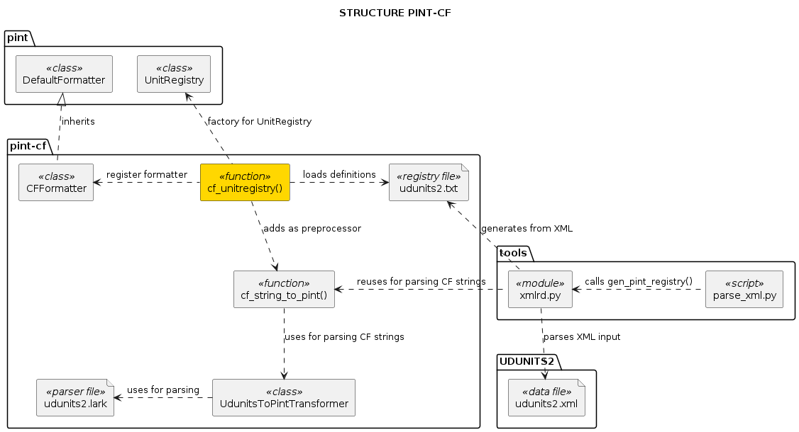
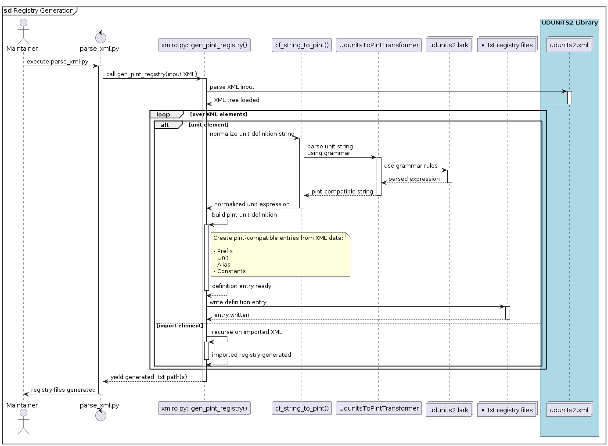
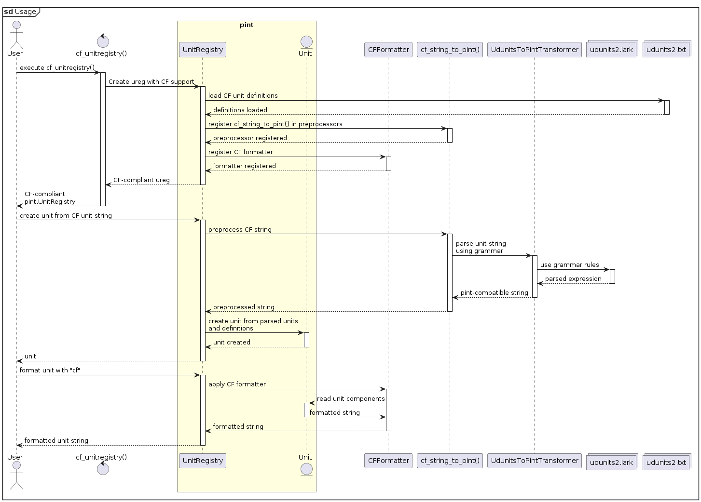

# Package overview

## Structure

`pint-cf` provides a single public function `cf_unitregistry()` that returns
a `pint.UnitRegistry` with these features:

- loads definitions from a previously generated pint registry file.
- adds a preprocessor `cf_string_to_pint()` to the  `UnitRegistry` that
  transforms CF strings into Pint strings at the `pint.Unit` creation time. It
  uses Lark grammar internally for parsing.
- register a custom formatter `CFFormatter` that transforms pint unit syntax into
  CF strings.

## Registry files generation

The registry file(s) are generated using a script excluded from the package.
The code is located in the directory `tools`. There are:

- The CLI script `parse_xml.py` that launches the process.
- The `.xml` files containing units definitions, obtained from the UDUNITS2
  library repository.
- A module `xmlrd.py` that transforms the XML elements into Pint Unit
  definitions:
  - Uses `cf_string_to_pint()` to generate the unit expression, consistently with
    the library.
  - Custom classes to build pint unit definitions from XML attributes, including
    comments from the xml file.

This generates the registry files that should be moved into the resource
folder of the library `src/pint_cf/resources/registry`

## Usage

Simply as:

1. Create the pint.UnitRegistry `ureg` by using `cf_unitregistry()`
2. Use the `ureg` as usual with pint. This will support CF syntax transparently
3. After data processing, obtain the resulting CF unit string by formatting the
   `Unit` with `cf` format.

